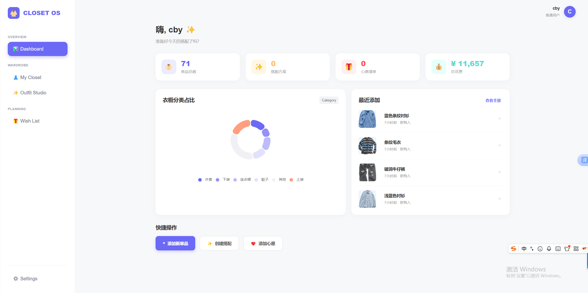

## 项目运行指南
### 0. 环境配置
`backend/` 目录下`requirements.txt`是运行所需依赖。

### 1. 数据库设置
1. 创建数据库 `finalpro_db`。
2. 进入 `backend/` 目录，将 `db.ini` 和`database.py`配置个人数据库用户名和密码。
3. 在同目录下运行`reset_db.py`文件创建项目所需数据库模式。

### 2. 后端启动
```bash
cd backend
pip install -r requirements.txt
uvicorn main:app --reload
# 我们提供了70条单品记录，可运行scripts\inject_local.py直接注入，注意这里需要修改相应用户id（默认为0）
```
### 3. 前端启动
```bash
cd frontend
npm install
npm run dev
```
### 运行过程中效果
**主界面**

**Closet界面**

**Outfit界面**

**Wishlist界面**
