## hsh 12.11
pip install python-multipart

请在前端项目根目录（frontend 文件夹下）运行：

npm install vue-cropper

npm install echarts

reset_db.py 可以执行init.sql 清空数据库并重新建新的空表

后端

cd backend

uvicorn main:app --reload

前端

cd frontend

npm run dev

## cby12.13
合了两个界面，分用户——涉及到前端的request.js、后端的security.py
搭配和衣橱两个界面还有细节要改
现在图片的处理逻辑有些问题

还是先运行后端的reset_db.py建表，保证数据库里面有这几张表
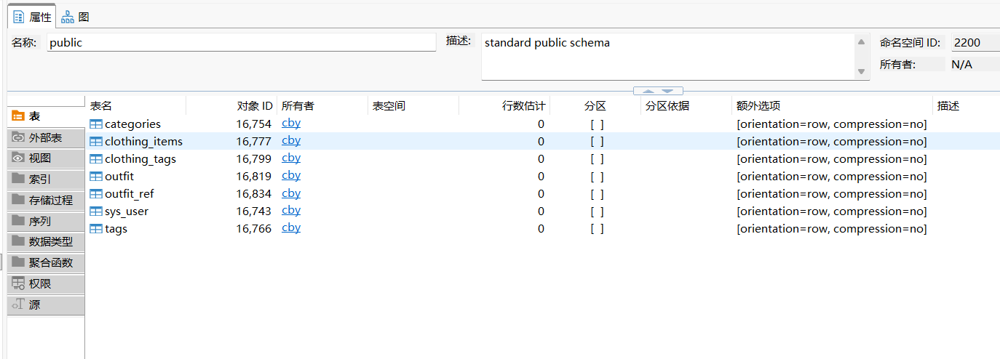
然后注册登录，保证有用户
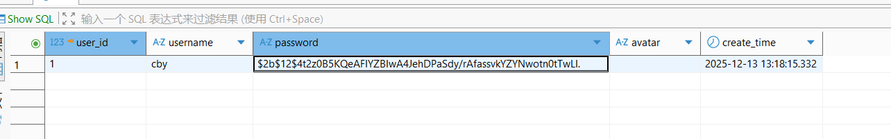
后端uvicorn main:app --reload
前端npm run dev
可以使用使用数据库用户端或者类似下的辅助查看数据库的应用手动先插入单品验证（放在./sql/test_item.sql）
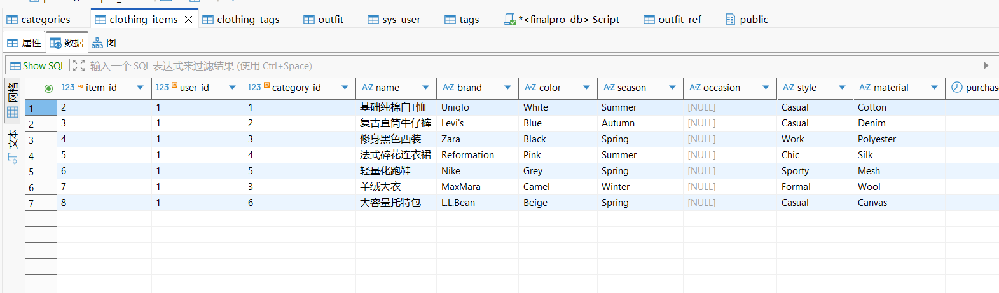

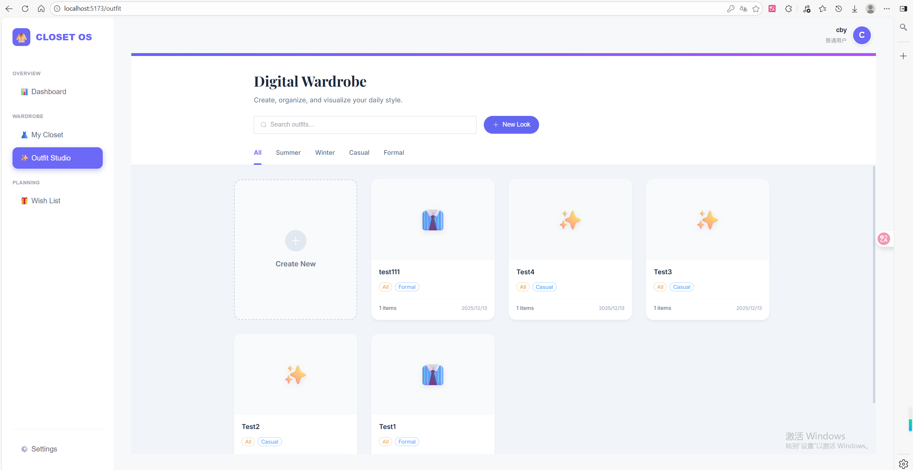
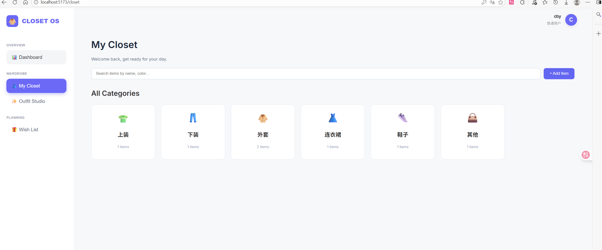

## cyx12.19
实现衣橱搜索功能，修改衣物添加和详细的前端ui；
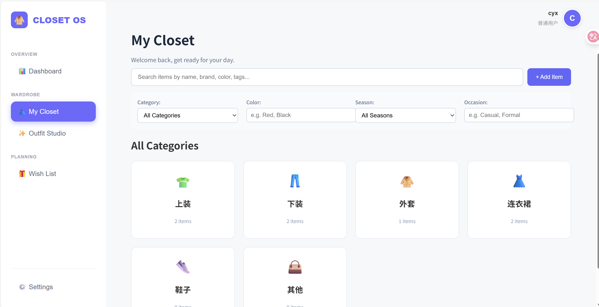
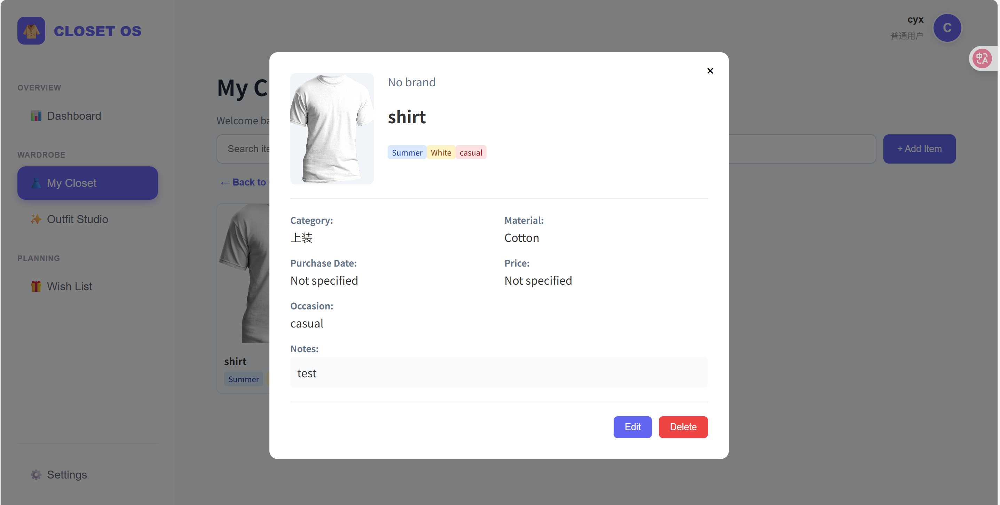
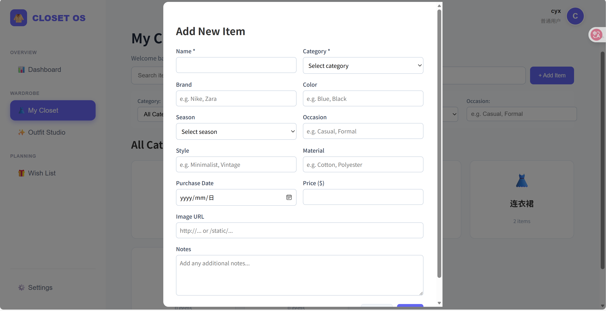
实现心愿单，ui会再改改；（添加了新数据库表）
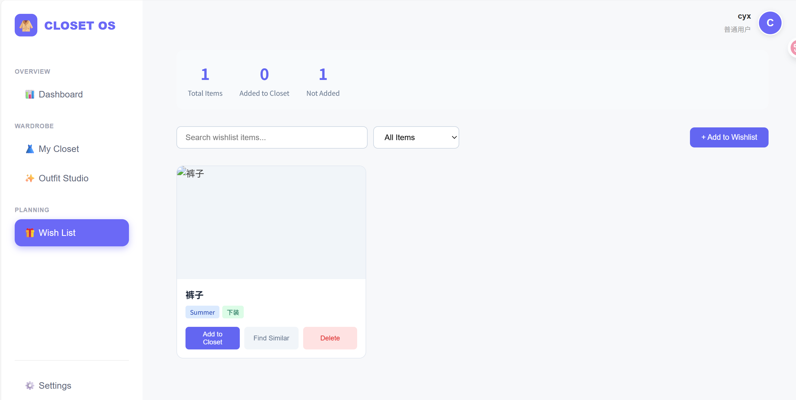

后端uvicorn main:app --reload
前端npm run dev

## cby 12.24
还是后端先运行reset_db，登录不上看db.ini和database.py里面有没有改用户名和密码！
如果出现关于权限的报错这里注意需要给用来连接数据库的用户授权。
omm 授权 ALTER USER cby SYSADMIN;

然后运行在backend目录下运行 python scripts\inject_local.py 注入数据，成功会有提示，注意这个文件中注入数据的用户id，我这里是1。

然后运行前端，这边可以测试功能。
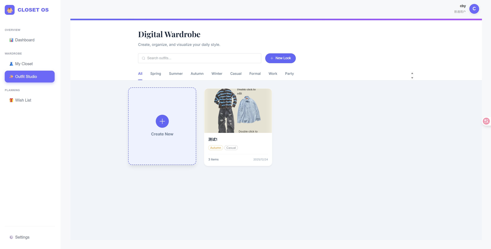

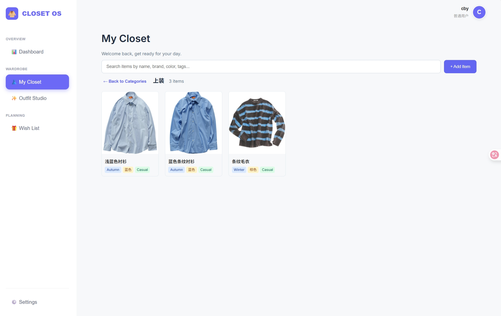

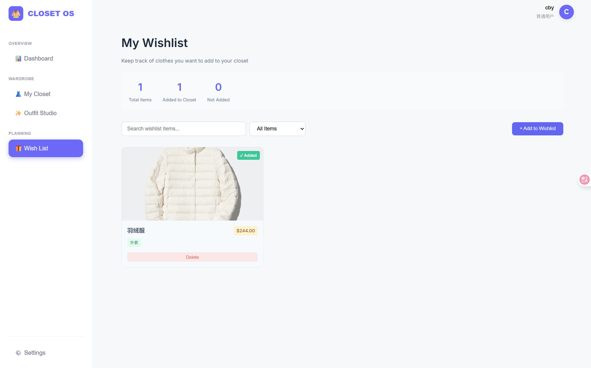

### ！添加数据
将图片放在backend/static/uploads/items里面
注意是png格式！
然后将信息填写到items文件夹下的items.json文件里面！

添加完后重新运行inject_local.py，看看有没有添加成功。

## cyx 12.25
添加了外套和连衣裙各十条数据，适配了中文搜索；
注意！！！记得改db.ini和database.py中的账号密码！！！
！！！拉取后步骤！！！
后端：
运行reset_db
运行uvicorn main:app --reload，重新注册新用户
运行python scripts\inject_local.py 注入数据，不然会自动创建新用户，密码会出错，导致点击其他功能网络错误闪退回登录页面（血泪教训）
最后重新运行uvicorn main:app --reload
前端：npm run dev